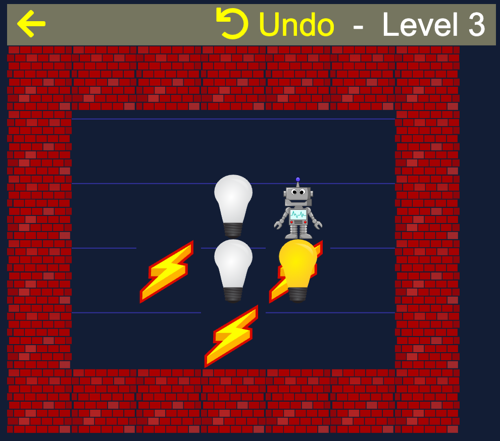

# PF2019

Pour Feliciter 2019 is a Sokoban-inspired puzzle game created as a New Year's greeting. The game challenges players to push light bulbs onto designated lightning spots to complete each level. Its intuitive mechanics and classic style provide an engaging experience for puzzle enthusiasts.

**Play the game online**: [PF2019 Game](https://georgik.rocks/html5-game-sokoban-pf2019/)



## Features

- **Classic Sokoban Gameplay**: Push light bulbs (o) onto lightning spots (x) throughout different levels.
- **Multiple Levels**: Over 10 unique levels to challenge your problem-solving skills.
- **Progress Saving**: Levels unlocked as you complete them, saved locally in your browser.
- **Responsive Design**: Compatible with desktop and mobile browsers.
- **Keyboard & Mouse Support**: Use arrow keys or click to move your character.
- **Undo Functionality**: Undo your last move with the spacebar.

## Technology

The game is built using modern web technologies:

- **Vue.js 2.6.14**: Framework for building the user interface
- **Vuex 3.0.1**: State management pattern and library for Vue.js applications
- **Vue Router 2.5.3**: Official router for Vue.js, handling navigation between levels
- **CSS3**: For styling and responsive design

## How to Play

1. **Movement**: Use keyboard arrow keys or click/tap to move the actor (player character).
2. **Objective**: Push light bulbs (o) onto all lightning spots (x) to complete the level.
3. **Rules**: 
   - You can only push one light bulb at a time
   - Light bulbs cannot be pulled, only pushed
   - You cannot push a light bulb into a wall or another light bulb
4. **Controls**:
   - Arrow keys: Move the character
   - Spacebar: Undo last move
   - Mouse/Touch: Click/tap to move towards that direction

## Level Design

Levels are defined in `js/levels.js` using a simple text format that makes it easy to create and modify puzzles:

```javascript
{
    levelMap: [
        "wwwwwww",
        "wa    w",
        "w ox  w",
        "w xo  w",
        "w     w",
        "wwwwwww"
    ],
    isLocked: true
}
```

**Symbols**:
- `a` - Actor (player character)
- `o` - Light bulb (pushable object)
- `x` - Lightning spot (target location)
- `w` - Wall (impassable)
- ` ` - Empty space (walkable)
- `r` - Reserved for future use

## Installation & Development

1. **Clone the repository**:
   ```bash
   git clone https://github.com/georgik/pf2019.git
   cd pf2019
   ```

2. **Run locally**:
   - Simply open `index.html` in your web browser
   - Or serve it via a local HTTP server:
     ```bash
     python3 -m http.server 8080
     # Then visit http://localhost:8080
     ```

3. **Development**:
   - No build process required - it's a pure HTML5/JavaScript game
   - Modify levels in `js/levels.js`
   - Game logic is in `js/game.js`
   - Styling in `css/game.css`
   
   **Development vs Production**:
   - The game uses `vue-2.6.14.min.js` (production/minified version) by default
   - For development, you can switch to `vue-2.6.14.js` (development version) in `index.html` to get Vue.js warnings and debugging features
   - Remember to switch back to the minified version for production deployment


Please open an issue or submit a pull request.

## License

This project is dual-licensed under both the MIT License and the Apache License Version 2.0. You may choose either license to use, reproduce, and distribute this software.

- **MIT License**: Permissive free software license with minimal restrictions
- **Apache License 2.0**: More detailed license that includes an express grant of patent rights from contributors to users

See the [LICENSE](LICENSE) file for the complete license texts.

## Credits

- **Author**: Juraj Michálek ([georgik.rocks](https://georgik.rocks))
- **Inspiration**: Classic Sokoban puzzle game
- **Level Design**: Inspired by [Borgar Þorsteinsson's Sokoban](http://borgar.net/programs/sokoban/#Intro)
- **Artwork**: CC OpenClips from Pixabay.com
